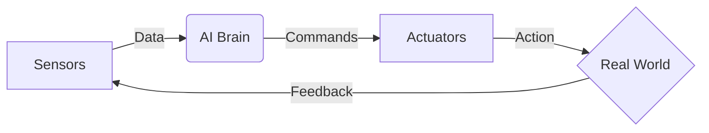

import Personalization from '@site/src/components/Personalization';

import Quiz from '@site/src/components/Quiz';

# Introduction to Physical AI

Welcome to the first module. This content adapts to your selected experience level using the toolbar above.

<Personalization level="novice">

### The Simple Explanation

Physical AI is like giving a robot a brain that understands the real world. 
Imagine a robot that doesn't just follow pre-programmed instructions but actually *feels* and *reacts* to its environment, much like a human does.

**Key Concepts:**
*   **Sensors:** The robot's eyes and ears.
*   **Actuators:** The robot's muscles.
*   **Brain:** The AI model that connects them.

</Personalization>

<Personalization level="expert">

### The Technical Deep Dive

Physical Artificial Intelligence (PAI) refers to the synthesis of AI algorithms with physical hardware systems, emphasizing the co-design of morphology and control. Unlike traditional robotics, where control logic is often hard-coded or based on rigid models, PAI leverages learning-based approaches (Reinforcement Learning, Neural Networks) to handle unstructured environments.

**Mathematical Foundation:**
We often model the agent-environment interaction as a Markov Decision Process (MDP):
$$
(S, A, P, R, \gamma)
$$
Where:
*   $S$: State space (sensor readings)
*   $A$: Action space (motor torques)
*   $P$: Transition probability distribution
*   $R$: Reward function

</Personalization>

### Universal Content

This section is visible to everyone, regardless of their settings. It covers the history of the field and safety protocols.

## Module Quiz

Test your understanding of the concepts introduced in this module.

<Quiz 
  questions={[
    {
      question: "What is the primary definition of Physical AI?",
      options: [
        "AI that exists only in the cloud",
        "The synthesis of AI algorithms with physical hardware systems",
        "A robot that looks exactly like a human",
        "A computer program that simulates physics"
      ],
      correctAnswer: 1
    },
    {
      question: "Which component acts as the 'muscles' of a robot?",
      options: [
        "Sensors",
        "Microcontroller",
        "Actuators",
        "Battery"
      ],
      correctAnswer: 2
    },
    {
      question: "In the MDP model (S, A, P, R, γ), what does 'S' stand for?",
      options: [
        "Speed",
        "Score",
        "System",
        "State Space"
      ],
      correctAnswer: 3
    }
  ]}
/>
