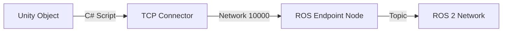
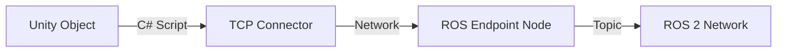

import Personalization from '@site/src/components/Personalization';
import Quiz from '@site/src/components/Quiz';

# 2.5 Connecting Worlds: The Unity-ROS 2 Bridge

<Personalization level="novice" language="english">

## How Unity Talks to ROS

**The Language Barrier**
Unity uses **C#** (C-Sharp). ROS 2 uses **Python/C++**. They cannot talk directly.
We need a translator. We use the **ROS-TCP-Connector**.

**The Architecture**
Imagine a telephone wire between Unity and ROS.
1.  **ROS Endpoint**: A node running in your terminal that acts as the "Server".
2.  **Unity Client**: A script in Unity that connects to that server.



### Step 1: Setting up the ROS Side
We need to install the endpoint package.

```bash
# Clone the repository
cd ~/ros2_ws/src
git clone https://github.com/Unity-Technologies/ROS-TCP-Endpoint.git

# Build
cd ~/ros2_ws
colcon build
source install/setup.bash

# Run the endpoint
ros2 run ros_tcp_endpoint default_server_endpoint --ros-args -p ROS_IP:=0.0.0.0
```
You will see: `Starting server on port 10000`. It is now listening.

### Step 2: Setting up the Unity Side
1.  In Unity, go to `Window > Package Manager`.
2.  Click `+` -> `Add package from git URL`.
3.  Enter: `https://github.com/Unity-Technologies/ROS-TCP-Connector.git?path=/com.unity.robotics.ros-tcp-connector`.
4.  A new menu item **Robotics** will appear in the top bar.
5.  Go to `Robotics > ROS Settings`. Set the IP address of your ROS computer (or `127.0.0.1` if it's the same machine).

### Step 3: Sending a Message (Publisher)
Let's make a cube tell ROS its position.
1.  Create a Cube.
2.  Create a new script `CubePublisher.cs`.

```csharp
using UnityEngine;
using Unity.Robotics.ROSTCPConnector;
using RosMessageTypes.Geometry; // Standard ROS messages

public class CubePublisher : MonoBehaviour
{
    ROSConnection ros;
    public string topicName = "cube_pose";

    void Start() {
        ros = ROSConnection.GetOrCreateInstance();
        ros.RegisterPublisher<PoseMsg>(topicName);
    }

    void Update() {
        PoseMsg msg = new PoseMsg();
        // Convert Unity coordinate to ROS coordinate
        msg.position.x = transform.position.z; 
        msg.position.y = -transform.position.x;
        msg.position.z = transform.position.y;
        
        ros.Publish(topicName, msg);
    }
}
```
*Note the coordinate conversion! Unity (Y-up) and ROS (Z-up) are different.*

</Personalization>

<Personalization level="expert" language="english">

## Message Serialization & Latency Management

**The Cost of Serialization**

The ROS-TCP-Connector relies on **BSON** or **JSON** serialization over TCP.
Every time you send a message, C# allocates memory, converts the object to bytes, sends it over the network, and Python/C++ deserializes it.
*   **Latency**: For a 100Hz control loop, this overhead is negligible.
*   **Bottleneck**: For 1080p Video (3MB per frame @ 30fps), this creates garbage collection (GC) pressure in Unity and latency spikes.

**Optimizing Large Data Transfer**
Do not use standard topics for Video/LIDAR over the TCP bridge if performance is critical.
1.  **Shared Memory**: If Unity and ROS are on the same machine, use a Named Pipe or Shared Memory segment.
2.  **Compression**: Compress the image (JPEG) in Unity before sending. It reduces size by 10x, trading CPU load for Network bandwidth.

### URDF Import Pipeline

Instead of building robots manually with cubes, we import the URDF.
Unity provides the **URDF Importer** package.
1.  `Assets > Import Robot from URDF`.
2.  Select your `.urdf` file.
3.  **Articulation Bodies**: Unity 2020+ introduced `ArticulationBody` physics component specifically for robotics.
    *   It replaces `Rigidbody` + `HingeJoint`.
    *   It uses Featherstone's algorithm (Reduced Coordinate Articulations) which is much more stable for kinematic chains than maximal coordinate joints.
    *   *Expert Tip*: Adjust the `Solver Iterations` in Project Settings > Physics if your robot arm is "floppy" or stretching.

### Coordinate Systems: The Handedness Trap

*   **Unity**: Left-Handed Coordinate System (Y-up, Z-forward).
*   **ROS**: Right-Handed Coordinate System (Z-up, X-forward).

The Connector handles basic conversion, but matrices (like Camera Intrinsics) often break.
**The Conversion Formula**:
To convert a position vector $(x, y, z)$ from Unity to ROS:
$$ V_{ros} = (z, -x, y) $$
To convert a Quaternion $(x, y, z, w)$:
$$ Q_{ros} = (-z, x, -y, w) $$

</Personalization>

<Personalization level="novice" language="urdu">

## Dunyaon Ka Milaap: Unity-ROS 2 Bridge

**Zaban Ka Masla**

Unity ki zaban **C#** hai. ROS 2 ki zaban **Python** hai. Yeh apas mein baat nahi kar sakte.
Humein ek tarjuman (translator) chahiye. Hum **ROS-TCP-Connector** use karte hain.

**Architecture (Dhaancha)**
Samjhein ke Unity aur ROS ke darmiyan telephone ki taar hai.
1.  **ROS Endpoint**: Terminal mein chalne wala program jo "Server" hai.
2.  **Unity Client**: Unity ka script jo us server ko call karta hai.



### Step 1: ROS Side Setup
Humein endpoint package install karna hai.

```bash
# Code download karein
cd ~/ros2_ws/src
git clone https://github.com/Unity-Technologies/ROS-TCP-Endpoint.git

# Build karein
cd ~/ros2_ws
colcon build
source install/setup.bash

# Server chalayein
ros2 run ros_tcp_endpoint default_server_endpoint --ros-args -p ROS_IP:=0.0.0.0
```
Likha aayega: `Starting server on port 10000`. Ab yeh sun raha hai.

### Step 2: Unity Side Setup
1.  Unity mein `Window > Package Manager` par jayein.
2.  `+` dabayein aur `Add package from git URL` select karein.
3.  Yeh link dalein: `https://github.com/Unity-Technologies/ROS-TCP-Connector.git?path=/com.unity.robotics.ros-tcp-connector`.
4.  Upar menu mein **Robotics** aa jaye ga.
5.  `Robotics > ROS Settings` mein apne computer ka IP likhein.

### Step 3: Message Bhejna (Publisher)
Aayein ek Cube ki position ROS ko bhejein.
1.  Cube banayein.
2.  Naya script `CubePublisher.cs` banayein.

```csharp
using UnityEngine;
using Unity.Robotics.ROSTCPConnector; // Library import ki
using RosMessageTypes.Geometry; 

public class CubePublisher : MonoBehaviour
{
    ROSConnection ros;
    public string topicName = "cube_pose";

    void Start() {
        // Connection shuru kiya
        ros = ROSConnection.GetOrCreateInstance();
        ros.RegisterPublisher<PoseMsg>(topicName);
    }

    void Update() {
        PoseMsg msg = new PoseMsg();
        // Unity ke coordinates ko ROS mein badla
        msg.position.x = transform.position.z; 
        msg.position.y = -transform.position.x;
        msg.position.z = transform.position.y;
        
        ros.Publish(topicName, msg);
    }
}
```

</Personalization>

<Personalization level="expert" language="urdu">

## Message Serialization aur Latency

**Data Bhejne Ki Qeemat**

Jab Unity se data ROS jata hai, to wo pehle "Serialize" (Bytes mein convert) hota hai, phir network se guzarta hai, phir "Deserialize" hota hai.
*   **Latency**: Chotay messages (position, speed) ke liye yeh masla nahi hai.
*   **Masla**: Video (Images) ke liye yeh bohat bhari kaam hai. Agar aap HD video bhejein gay to Unity ruk ruk kar chalega (Garbage Collection spikes).

**Bara Data Kaise Bhejein?**
1.  **Compression**: Tasveer ko JPEG bana kar bhejein. Size 10 guna kam ho jata hai.
2.  **Shared Memory**: Agar dono aik hi computer par hain, to network ki bajaye Shared Memory use karein (Fastest).

### URDF Import Pipeline

Hum Unity mein dunday aur dibbay jor kar robot nahi banate. Hum seedha URDF import karte hain.
Unity ka **URDF Importer** package use karein.

**Articulation Bodies**
Unity 2020+ mein ek nayi physics aayi hai: **ArticulationBody**.
*   Yeh robot arms ke liye banayi gayi hai.
*   Pehle hum `Rigidbody` aur `HingeJoint` use karte thay, jo ke aksar "dheelay" (floppy) hotay thay.
*   ArticulationBody **Featherstone Algorithm** use karta hai jo bohat stable hai.

### Coordinate Systems: Dayein aur Bayein ka Farq

*   **Unity**: Left-Handed (Y-upar, Z-aagay).
*   **ROS**: Right-Handed (Z-upar, X-aagay).

Agar aap ne conversion formula nahi lagaya, to robot ulta ho jaye ga.
**Formula**:
ROS vector = $(z, -x, y)$ (Unity vector).

</Personalization>

<Quiz questions={[
  {
    question: "What is the role of the ROS-TCP-Endpoint node?",
    options: [
      "It runs the physics simulation",
      "It acts as a server to relay messages between Unity (Client) and the ROS 2 network",
      "It visualizes the robot",
      "It compiles the C# code"
    ],
    correctAnswer: 1
  },
  {
    question: "Which physics component is recommended for robots in modern Unity versions?",
    options: ["Rigidbody", "ArticulationBody", "MeshCollider", "SoftBody"],
    correctAnswer: 1
  },
  {
    question: "Urdu: Unity aur ROS ke coordinate system mein kya bunyadi farq hai?",
    options: [
      "Koi farq nahi",
      "Unity Left-Handed (Y-up) hai, ROS Right-Handed (Z-up) hai",
      "Unity mein gravity nahi hoti",
      "ROS mein X-axis upar hota hai"
    ],
    correctAnswer: 1
  }
]} />