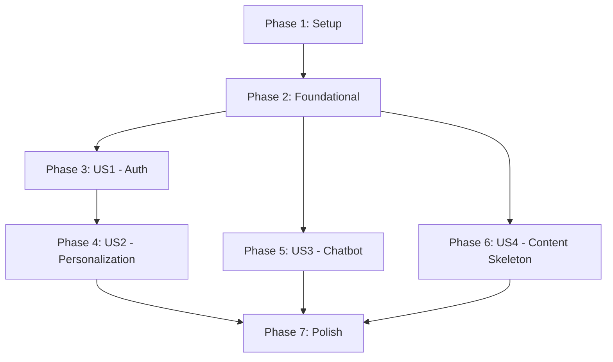

# Tasks for Feature: AI-Native Textbook Platform Skeleton

**Branch**: `001-ai-native-textbook-platform`
**Feature Spec**: `specs/001-ai-native-textbook-platform/spec.md`
**Implementation Plan**: `specs/001-ai-native-textbook-platform/plan.md`

This document was auto-generated by the `/sp.tasks` command. It breaks down the feature into a dependency-ordered task list.

## Implementation Strategy

The feature will be implemented in phases, starting with an MVP and incrementally adding functionality. The phases are organized by user story priority, ensuring that the most critical features are delivered first.

**MVP Scope**: The MVP will focus on delivering User Story 1, which includes setting up the project, configuring authentication, and creating a basic profile page.

## Dependencies

The user stories have the following dependencies:
- **US1** is a prerequisite for **US2**. A user must be able to log in and have a profile before their experience can be personalized.
- **US3** and **US4** are largely independent and can be worked on in parallel with other stories after the initial setup.

## Parallel Execution

- **User Stories**: US3 (Chatbot) and US4 (Content Skeleton) can be developed in parallel after Phase 2 is complete.
- **Within Stories**: Tasks marked with `[P]` can be executed in parallel.

---

## Phase 1: Project Setup

**Goal**: Initialize the Docusaurus project and configure the core technologies.

- [x] T001 Initialize a new Docusaurus project with the TypeScript template in the repository root.
- [x] T002 [P] Install and configure Tailwind CSS for the Docusaurus project, including `tailwind.config.js`, `postcss.config.js`, and `src/css/custom.css`.
- [x] T003 [P] Install and configure `@docusaurus/theme-mermaid` in `docusaurus.config.ts`.
- [x] T004 [P] Install the `better-auth/react` client library via npm/yarn.
- [x] T005 Create the global `PersonalizationProvider` in `src/contexts/PersonalizationProvider.tsx` to manage `experienceLevel` and `language`.
- [x] T006 Wrap the root of the application with `PersonalizationProvider` in a custom `src/theme/Root.tsx` file.
- [x] T007 Integrate the `better-auth/react` provider into `src/theme/Root.tsx`, wrapping the application.

---

## Phase 3: User Story 1 - Auth & Profile Setup (P1)

**Goal**: As a new student, I want to create an account, log in, and set my preferred experience level and language.
**Independent Test**: A user can navigate to the site, log in, visit a profile page, and see their chosen settings.

- [x] T008 [US1] Create a `ProfilePage` at `src/pages/profile.tsx` that displays user information and preferences after login.
- [x] T009 [US1] Implement UI elements (e.g., buttons, dropdowns) on the `ProfilePage` for selecting experience level and language.
- [ ] T010 [US1] Connect the UI elements to the `PersonalizationProvider` to update the user's state on selection.

## Phase 4: User Story 2 - Personalized Content (P2)

**Goal**: As a logged-in student, I want to see content adapt to my selected experience level.
**Independent Test**: Two users with different experience levels see different versions of a content block on the same page.

- [ ] T011 [P] [US2] Create the `<PersonalizationWrapper>` component in `src/components/Personalization/PersonalizationWrapper.tsx`.
- [ ] T012 [P] [US2] Create the `usePersonalization` hook in `src/components/Personalization/usePersonalization.ts` to provide easy access to the personalization context.

## Phase 5: User Story 3 - Interactive Chatbot (P3)

**Goal**: As a student, I want to ask a question in a chat widget and receive an answer.
**Independent Test**: A user can open a chat widget on any page, type a question, and see it appear in the chat history.

- [x] T013 [P] [US3] Create the basic UI for the `<ChatWidget>` component in `src/components/ChatWidget/index.tsx`.
- [x] T014 [US3] Implement the logic to make the `<ChatWidget>` a floating component available on all pages.
- [x] T015 [US3] Add state management for chat history and a text input form to the `<ChatWidget>`.

## Phase 6: User Story 4 - Content Skeleton (P4)

**Goal**: As a content author, I want the entire course structure to be pre-defined with placeholder pages.
**Independent Test**: The deployed site shows a complete sidebar with links for all modules, and all links are clickable.

- [x] T016 [P] [US4] Create the directory structure for all course modules (e.g., `docs/module-1`, `docs/module-2`, etc.).
- [x] T017 [P] [US4] Create placeholder `intro.mdx` files inside each module directory with a simple title.
- [x] T018 [US4] Update `sidebars.ts` to define the navigation structure, ensuring all created placeholder pages are linked.

---

## Phase 7: Polish & Cross-Cutting Concerns

**Goal**: Finalize the project, verify deployment, and ensure high quality.

- [x] T019 Configure the `docusaurus.config.ts` for deployment to GitHub Pages and run `npm run deploy`.
- [x] T020 Perform a final review of the site to ensure consistent styling and responsive design across all pages.
